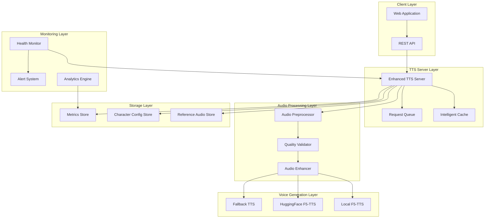
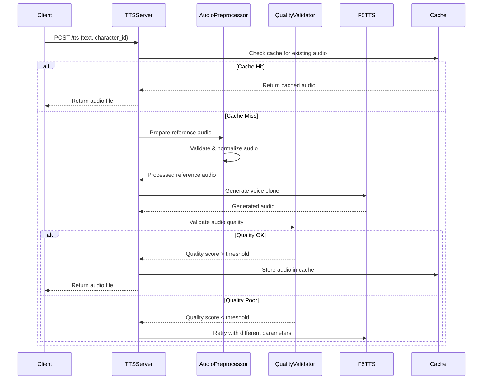

# F5-TTS Voice Cloning Accuracy - Technical Design

## Overview

This design document outlines the technical architecture for improving F5-TTS voice cloning accuracy in the EchoLegacy system. The current implementation uses HuggingFace F5-TTS Gradio space with basic character configuration, but lacks quality control, proper reference audio management, and optimization mechanisms.

The enhanced system will provide:
- Intelligent reference audio management and preprocessing
- Voice similarity scoring using speaker verification models
- Automated quality control pipeline with validation
- Character-specific F5-TTS parameter optimization
- Enhanced TTS server with fallback mechanisms
- Audio processing and enhancement pipeline
- Comprehensive monitoring and diagnostics
- Tools for reference audio preparation

## Architecture

### High-Level System Architecture



### Component Interaction Flow



## Components and Interfaces

### 1. Enhanced TTS Server

**Purpose**: Central orchestration service that manages voice generation requests with intelligent routing, caching, and quality control.

**Key Features**:
- Request queuing and prioritization
- Intelligent caching based on content similarity
- Backend selection and fallback management
- Performance monitoring and metrics collection

**Interface**:
```python
class EnhancedTTSServer:
    def generate_voice(self, text: str, character_id: str, options: TTSOptions) -> AudioResult
    def health_check(self) -> HealthStatus
    def get_metrics(self) -> TTSMetrics
    def clear_cache(self, character_id: Optional[str] = None) -> bool
```

### 2. Audio Preprocessor

**Purpose**: Validates, normalizes, and optimizes reference audio files for optimal voice cloning performance.

**Key Features**:
- Audio quality validation (sample rate, noise levels, clarity)
- Automatic normalization and silence removal
- Optimal segment extraction from long recordings
- Format conversion and standardization

**Interface**:
```python
class AudioPreprocessor:
    def validate_audio(self, audio_path: Path) -> ValidationResult
    def normalize_audio(self, audio_path: Path) -> Path
    def extract_optimal_segment(self, audio_path: Path, target_duration: int) -> Path
    def convert_format(self, audio_path: Path, target_format: str) -> Path
```

### 3. Quality Validator

**Purpose**: Measures voice similarity and detects audio artifacts to ensure high-quality voice clones.

**Key Features**:
- Speaker verification model integration
- Voice similarity scoring
- Audio artifact detection (clipping, distortion, unnatural pauses)
- Quality threshold enforcement

**Interface**:
```python
class QualityValidator:
    def calculate_similarity_score(self, generated_audio: Path, reference_audio: Path) -> float
    def detect_artifacts(self, audio_path: Path) -> List[AudioArtifact]
    def validate_quality(self, audio_path: Path, threshold: float) -> ValidationResult
```

### 4. Character Configuration Manager

**Purpose**: Manages character-specific F5-TTS parameters and optimization settings.

**Key Features**:
- Character-specific parameter storage
- Parameter optimization based on historical performance
- A/B testing support for parameter tuning
- Configuration validation and defaults

**Interface**:
```python
class CharacterConfigManager:
    def get_character_config(self, character_id: str) -> CharacterConfig
    def update_parameters(self, character_id: str, params: TTSParameters) -> bool
    def optimize_parameters(self, character_id: str, performance_data: List[GenerationResult]) -> TTSParameters
```

### 5. Voice Generation Backends

**Purpose**: Multiple F5-TTS backends with automatic fallback and load balancing.

**Backends**:
- Local F5-TTS installation (primary)
- HuggingFace Gradio space (secondary)
- Alternative TTS services (fallback)

**Interface**:
```python
class VoiceGenerationBackend:
    def generate(self, text: str, reference_audio: Path, params: TTSParameters) -> AudioResult
    def is_available(self) -> bool
    def get_quota_status(self) -> QuotaStatus
```

## Data Models

### Character Configuration
```python
@dataclass
class CharacterConfig:
    character_id: str
    reference_audio_path: Path
    reference_text: str
    tts_parameters: TTSParameters
    quality_threshold: float
    optimization_history: List[ParameterResult]
```

### TTS Parameters
```python
@dataclass
class TTSParameters:
    temperature: float = 0.7
    top_p: float = 0.9
    speed: float = 1.0
    pitch_adjustment: float = 0.0
    noise_scale: float = 0.667
    length_scale: float = 1.0
```

### Audio Quality Metrics
```python
@dataclass
class AudioQualityMetrics:
    similarity_score: float
    clarity_score: float
    naturalness_score: float
    artifacts_detected: List[str]
    generation_time: float
    backend_used: str
```

### Validation Result
```python
@dataclass
class ValidationResult:
    is_valid: bool
    quality_score: float
    issues: List[str]
    recommendations: List[str]
```

## Correctness Properties

*A property is a characteristic or behavior that should hold true across all valid executions of a system-essentially, a formal statement about what the system should do. Properties serve as the bridge between human-readable specifications and machine-verifiable correctness guarantees.*

### Property 1: Audio Quality Validation Consistency

*For any* reference audio file with measurable quality parameters, the Audio_Preprocessor validation SHALL consistently accept files meeting minimum standards (16kHz+ sample rate, clear speech, minimal background noise) and reject files below these thresholds.

**Validates: Requirements 1.1**

### Property 2: Audio Normalization Preservation

*For any* valid audio file, applying Audio_Preprocessor normalization SHALL preserve the original speech content while producing consistent output levels and removing silence, such that the processed audio maintains the same duration of actual speech content.

**Validates: Requirements 1.3**

### Property 3: Optimal Segment Extraction Bounds

*For any* audio file exceeding 30 seconds, the Audio_Preprocessor SHALL extract a segment between 10-30 seconds that represents the clearest portion of the original audio, measured by signal-to-noise ratio and speech clarity metrics.

**Validates: Requirements 1.4**

### Property 4: Format Conversion Consistency

*For any* supported audio format (WAV, MP3, FLAC), the F5_TTS_System SHALL convert the input to the optimal format while preserving audio quality, such that the converted audio maintains equivalent acoustic characteristics to the original.

**Validates: Requirements 1.5**

### Property 5: Voice Similarity Threshold Compliance

*For any* generated voice clone, when compared to its reference audio using speaker verification models, the F5_TTS_System SHALL achieve a Voice_Similarity_Score of at least 0.75, or trigger regeneration with optimized parameters.

**Validates: Requirements 2.1**

### Property 6: Voice Quality Consistency Across Text Lengths

*For any* text input between 10 and 500 words, the F5_TTS_System SHALL maintain consistent voice quality metrics (similarity score, clarity, naturalness) within a 10% variance range for the same character.

**Validates: Requirements 2.3**

### Property 7: Reference Text Accuracy Improvement

*For any* voice generation request, when reference text is provided alongside reference audio, the resulting Voice_Similarity_Score SHALL be higher than generation without reference text, demonstrating improved voice matching accuracy.

**Validates: Requirements 2.4**

### Property 8: Quality Validation Threshold Enforcement

*For any* generated audio with a Voice_Similarity_Score below 0.70, the Quality_Validator SHALL reject the output and trigger regeneration with different parameters, ensuring no low-quality audio is delivered to users.

**Validates: Requirements 3.2**

### Property 9: Audio Artifact Detection Accuracy

*For any* audio containing detectable artifacts (clipping, distortion, unnatural pauses), the Quality_Validator SHALL identify and flag these issues with appropriate artifact type classification.

**Validates: Requirements 3.3**

### Property 10: Metrics Logging Completeness

*For any* voice generation request, the F5_TTS_System SHALL log all required quality metrics (generation time, similarity score, backend used, parameters) to enable comprehensive performance monitoring.

**Validates: Requirements 3.4, 7.1**

### Property 11: Character-Specific Parameter Application

*For any* voice generation request, the F5_TTS_System SHALL apply the character-specific optimization parameters (temperature, top_p, speed, pitch adjustment) configured for that character, ensuring personalized voice generation.

**Validates: Requirements 4.2**

### Property 12: Successful Parameter Caching

*For any* voice generation that achieves quality scores above threshold, the F5_TTS_System SHALL cache the successful parameter combination for that character to improve future generation efficiency.

**Validates: Requirements 4.5**

### Property 13: Performance Time Bounds

*For any* text input up to 200 words, the TTS_Server SHALL complete voice generation within 30 seconds, including all processing, validation, and enhancement steps.

**Validates: Requirements 5.1**

### Property 14: Intelligent Caching Behavior

*For any* identical text and character combination, the F5_TTS_System SHALL serve the result from cache on subsequent requests, avoiding redundant generation while maintaining cache validity.

**Validates: Requirements 5.4**

### Property 15: Concurrent Request Quality Maintenance

*For any* set of simultaneous voice generation requests, the TTS_Server SHALL maintain the same quality standards (similarity scores, artifact detection) as single requests, without quality degradation due to concurrency.

**Validates: Requirements 5.5**

### Property 16: Audio Format Consistency

*For any* character and text combination, the F5_TTS_System SHALL output audio at consistent format specifications (22kHz sample rate, 16-bit depth) regardless of the input reference audio format.

**Validates: Requirements 6.1**

### Property 17: Audio Enhancement Effectiveness

*For any* generated audio processed through the Audio_Preprocessor enhancement pipeline, the output SHALL demonstrate measurable improvements in clarity and noise reduction compared to the unprocessed audio.

**Validates: Requirements 6.2**

### Property 18: Volume Normalization Consistency

*For any* generated audio with volume inconsistencies, the Audio_Preprocessor SHALL normalize audio levels to produce consistent output volume across all generated content for the same character.

**Validates: Requirements 6.3**

### Property 19: Acoustic Characteristic Matching

*For any* generated voice clone, the F5_TTS_System SHALL apply audio processing to match the acoustic characteristics (frequency response, dynamic range) of the reference audio within measurable tolerances.

**Validates: Requirements 6.4**

### Property 20: Error Context Capture Completeness

*For any* error condition during voice generation, the F5_TTS_System SHALL capture detailed error context including input parameters, system state, and backend status to enable effective debugging.

**Validates: Requirements 7.5**

### Property 21: Speech Segment Extraction Quality

*For any* longer audio recording, the Audio_Preprocessor SHALL extract clean speech segments that demonstrate higher clarity scores than randomly selected segments of the same duration.

**Validates: Requirements 8.1**

### Property 22: Clarity Analysis Accuracy

*For any* reference audio with varying clarity throughout, the Audio_Preprocessor SHALL identify and recommend segments with the highest speech clarity scores for optimal voice cloning performance.

**Validates: Requirements 8.2**

### Property 23: A/B Testing Comparison Validity

*For any* two different reference audio samples for the same character, the F5_TTS_System SHALL provide meaningful comparison metrics that accurately reflect the relative voice cloning performance of each sample.

**Validates: Requirements 8.3**

### Property 24: Text-Audio Alignment Validation

*For any* reference text and audio pair, the Audio_Preprocessor SHALL accurately validate whether the spoken content matches the provided text, detecting misalignments with appropriate confidence scores.

**Validates: Requirements 8.4**

### Property 25: Quality Feedback Accuracy

*For any* reference audio sample, the F5_TTS_System SHALL provide quality feedback and improvement suggestions that correlate with measurable voice cloning performance improvements when implemented.

**Validates: Requirements 8.5**

## Error Handling

### Error Categories and Responses

1. **Reference Audio Errors**
   - Missing files: Clear error messages with specific file paths
   - Invalid format: Automatic conversion attempts with fallback errors
   - Poor quality: Detailed quality analysis with improvement suggestions

2. **Generation Errors**
   - Backend unavailability: Automatic fallback to alternative backends
   - Quota exhaustion: Queue requests with estimated wait times
   - Quality validation failures: Retry with optimized parameters (max 3 attempts)

3. **System Errors**
   - Cache failures: Graceful degradation to direct generation
   - Configuration errors: Default parameter fallback with warnings
   - Network errors: Exponential backoff retry with circuit breaker

### Error Recovery Strategies

```python
class ErrorRecoveryManager:
    def handle_backend_failure(self, backend: str, error: Exception) -> BackendSelection
    def handle_quality_failure(self, attempt: int, quality_score: float) -> RetryStrategy
    def handle_quota_exhaustion(self, backend: str) -> FallbackStrategy
```

## Testing Strategy

### Unit Testing
- **Audio Processing**: Test normalization, validation, and format conversion with various audio samples
- **Quality Validation**: Test similarity scoring and artifact detection with known good/bad audio pairs
- **Configuration Management**: Test parameter loading, validation, and optimization logic
- **Caching Logic**: Test cache hit/miss scenarios and invalidation strategies

### Property-Based Testing
- **Minimum 100 iterations per property test** to ensure comprehensive coverage
- **Property test configuration**: Each test references its design document property
- **Tag format**: **Feature: f5-tts-voice-cloning-accuracy, Property {number}: {property_text}**

**Property Test Libraries**:
- Python: Hypothesis for property-based testing
- Audio testing: librosa for acoustic feature analysis
- Speaker verification: speechbrain or similar models for similarity scoring

### Integration Testing
- **End-to-end voice generation**: Test complete pipeline from text input to audio output
- **Backend fallback**: Test automatic switching between F5-TTS backends
- **Performance testing**: Measure generation times and concurrent request handling
- **Quality validation**: Test with real character voices and measure similarity scores

### Performance Testing
- **Load testing**: Concurrent request handling up to system limits
- **Latency testing**: Generation time measurement across different text lengths
- **Memory usage**: Monitor memory consumption during batch processing
- **Cache effectiveness**: Measure cache hit rates and performance improvements

## Deployment Considerations

### Infrastructure Requirements
- **GPU Support**: NVIDIA GPU with CUDA for local F5-TTS (RTX 3050 4GB minimum)
- **Storage**: SSD storage for audio cache and reference files
- **Memory**: 16GB RAM minimum for concurrent request processing
- **Network**: Stable internet connection for HuggingFace API access

### Configuration Management
- **Environment Variables**: Secure token management for external APIs
- **Character Profiles**: Centralized configuration for all character parameters
- **Quality Thresholds**: Configurable quality standards per deployment environment
- **Cache Settings**: Adjustable cache size and TTL based on usage patterns

### Monitoring and Alerting
- **Health Checks**: Regular backend availability and performance monitoring
- **Quality Metrics**: Continuous tracking of voice similarity scores and generation success rates
- **Error Rates**: Alert on elevated error rates or quality degradation
- **Performance Metrics**: Monitor generation times and system resource usage

This technical design provides a comprehensive foundation for implementing high-accuracy F5-TTS voice cloning while maintaining compatibility with the existing EchoLegacy system architecture.